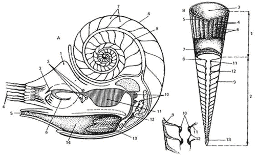

Hyponome
========

Hyponome is a [content-addressable](https://en.wikipedia.org/wiki/Content-addressable_storage) file store with a simple REST interface, accessible via HTTP.

```
$ cat > hello.txt << EOF
> Hello, world!
> EOF

$ sha256sum hello.txt
d9014c4624844aa5bac314773d6b689ad467fa4e1d1a50a1b8a99d5a95f72ff5  hello.txt

$ curl -F file=@hello.txt http://localhost:3000/objects
{
  "name": "hello.txt",
  "hash": {
    "SHA256Hash": "d9014c4624844aa5bac314773d6b689ad467fa4e1d1a50a1b8a99d5a95f72ff5"
  },
  "contentType": "text/plain; charset=UTF-8",
  "status": "Created",
  "file": {
    "URI": "http://thalassa:3000/objects/d9014c4624844aa5bac314773d6b689ad467fa4e1d1a50a1b8a99d5a95f72ff5/hello.txt"
  },
  "length": 14,
  "remoteAddress": {
    "InetAddress": "192.168.1.253"
  }
}%

$ curl http://localhost:3000/objects/d9014c4624844aa5bac314773d6b689ad467fa4e1d1a50a1b8a99d5a95f72ff5/hello.txt
Hello, world!

$ curl -s http://localhost:3000/objects/d9014c4624844aa5bac314773d6b689ad467fa4e1d1a50a1b8a99d5a95f72ff5/hello.txt | sha256sum
d9014c4624844aa5bac314773d6b689ad467fa4e1d1a50a1b8a99d5a95f72ff5  -
```

## Rationale

This project exists primarily as a vehicle for exploring ideas related to content-addressable storage, capability-based security, and distributed systems.  See [design](doc/Design.md) and [plans](doc/Plans.md) for more information.

## Usage

In order to use hyponome, you will need [a JDK](http://openjdk.java.net/) and [sbt](http://www.scala-sbt.org/).

```
$ git clone https://github.com/henrytill/hyponome.git

$ cd hyponome

$ sbt run
```

You can also build and run a standalone jar:
```
$ sbt assembly

$ java -cp target/scala-2.11/hyponome-assembly-0.1.0-SNAPSHOT.jar hyponome.Main
```
